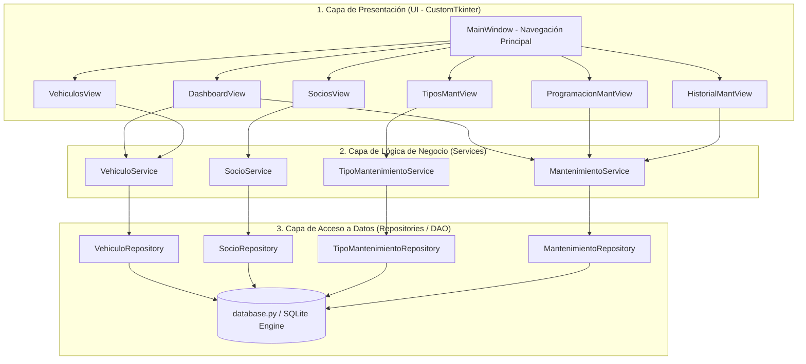
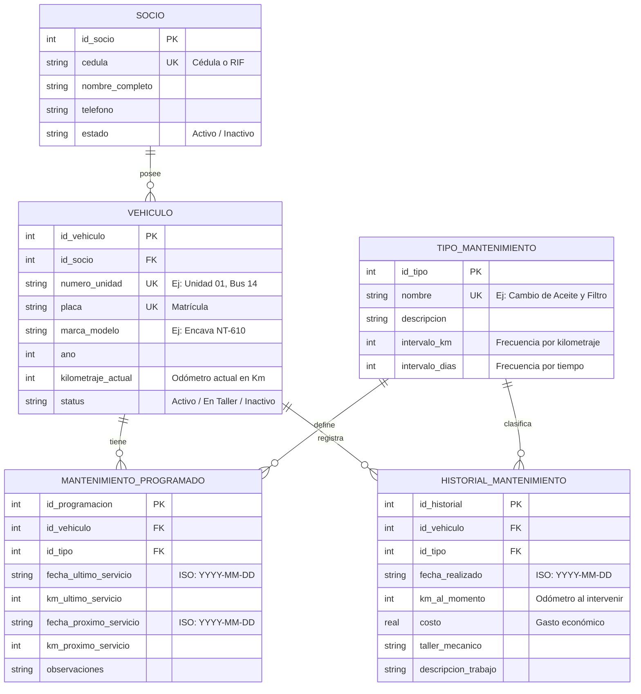

# 🏛️ Arquitectura y Estructura del Sistema
## Sistema de Control de Mantenimiento Preventivo — Brisas del Palmar

---

## 1. Visión General de la Arquitectura

El sistema está diseñado bajo un patrón arquitectónico en **3 Capas Desacopladas (Layered Architecture / MVC adaptado a GUI de escritorio)**. Cada capa posee responsabilidades estrictamente delimitadas, garantizando mantenibilidad, alta cohesión y bajo acoplamiento.



### Principios de Separación:
1. **La Interfaz Visual (`views/`) NUNCA ejecuta sentencias SQL:** Su única función es renderizar elementos en pantalla, capturar eventos de usuario y delegar las acciones a los *Services*.
2. **Los Servicios (`services/`) concentran las reglas del negocio:** Aquí residen las validaciones de entrada, el cálculo matemático de fechas y kilometrajes, las condiciones de semaforización y la lógica de reprogramación automática.
3. **Los Repositorios (`repositories/`) aíslan el motor de datos:** Encapsulan todas las consultas SQL (`SELECT`, `INSERT`, `UPDATE`, `DELETE`) y transacciones.
4. **Configuración Centralizada (`config/database.py`):** Ningún archivo almacena rutas o credenciales duplicadas. Toda la conexión, manejo de claves foráneas y migraciones DDL se gestionan en este punto.

---

## 2. Motor de Base de Datos (SQLite)

### ¿Por qué SQLite y no un servidor de base de datos externo?
- **Cero Configuración:** No requiere instalar ni mantener un servicio o demonio corriendo en segundo plano (evita los fallos clásicos de desconexión `Connection Refused` o error 2003 de MySQL).
- **Portabilidad Absoluta:** Toda la información de la empresa vive en un único archivo físico (`data/mantenimiento.db`). Respaldar el sistema completo se reduce a copiar este archivo.
- **Rendimiento Excepcional en Escritorio:** Al interactuar directamente mediante llamadas a la API de C de SQLite en el sistema de archivos local, se elimina la latencia de protocolos de red TCP/IP.
- **Integridad Referencial Garantizada:** Se activa explícitamente `PRAGMA foreign_keys = ON;` para forzar relaciones estrictas entre socios, vehículos y mantenimientos.

---

## 3. Modelo de Datos Relacional



### Reglas de Integridad:
- **Protección de Socios:** La base de datos y la capa de servicios impiden la eliminación de un socio si tiene vehículos asociados (`ON DELETE RESTRICT`).
- **Eliminación en Cascada de Vehículos:** Al eliminar una unidad, se eliminan sus programaciones activas asociadas (`ON DELETE CASCADE`), pero su bitácora histórica puede mantenerse auditada.
- **Unicidad:** La cédula del socio, la placa del vehículo y el número interno de unidad son claves únicas (`UNIQUE`).

---

## 4. Motor de Mantenimiento Preventivo y Semaforización

El corazón del sistema evalúa simultáneamente dos variables de desgaste:
1. **Desgaste por Uso Físico (Kilómetros recorridos):** $\Delta_{\text{km}} = \text{km\_próximo} - \text{km\_actual}$
2. **Degradación por Tiempo (Días transcurridos):** $\Delta_{\text{días}} = \text{fecha\_próxima} - \text{fecha\_hoy}$

### Matriz de Estados de Alerta:

| Estado | Indicador Visual | Condición Matemática | Acción Recomendada |
| :--- | :---: | :--- | :--- |
| **Vencido** | 🔴 Rojo | $\Delta_{\text{km}} \le 0$  ó  $\Delta_{\text{días}} \le 0$ | **Urgente:** La unidad debe ingresar al taller inmediatamente para evitar roturas mecánicas o multas operativas. |
| **Por Vencer** | 🟡 Amarillo | $1 \le \Delta_{\text{km}} \le 500$  ó  $1 \le \Delta_{\text{días}} \le 10$ | **Planificación:** Restan menos de 500 km o 10 días; preparar repuestos y agendar turno en taller. |
| **Al Día** | 🟢 Verde | $\Delta_{\text{km}} > 500$  y  $\Delta_{\text{días}} > 10$ | **Óptimo:** Unidad apta para operar en ruta regular. |

### Ciclo de Ejecución de Mantenimiento:
Cuando el usuario registra un mantenimiento ejecutado en [`ProgramacionMantView`](file:///home/yheremyt/PROYECTO-MANTENIMIENTO/src/views/programacion_mant_view.py):
1. Se crea un registro inmutable en `historial_mantenimiento` con fecha, taller, costo y detalles.
2. Si el odómetro ingresado es superior al odómetro registrado del vehículo, `vehiculo.kilometraje_actual` se actualiza automáticamente.
3. Se recalcula el próximo vencimiento:
   $$\text{km\_próximo} = \text{km\_servicio} + \text{intervalo\_km}$$
   $$\text{fecha\_próxima} = \text{fecha\_servicio} + \text{intervalo\_días}$$
4. El semáforo vuelve automáticamente a 🟢 **Al Día**.

---

## 5. Estructura de Directorios del Código

```text
PROYECTO-MANTENIMIENTO/
├── config/
│   ├── __init__.py
│   └── database.py                 # Conexión SQLite, función init_db() y gestor de contexto
├── database/
│   ├── schema.sql                  # Definición DDL de tablas e índices
│   └── seeds.sql                   # Catálogo inicial de 10 mantenimientos preventivos estándar
├── docs/                           # Documentación técnica y manuales de usuario
│   ├── ARQUITECTURA.md             # Este documento
│   ├── GUIA_INSTALACION_Y_USO.md   # Guía paso a paso de despliegue y manual de usuario
│   └── README.md                   # Índice general de documentación
├── src/
│   ├── repositories/               # Capa de Acceso a Datos
│   │   ├── socio_repository.py
│   │   ├── vehiculo_repository.py
│   │   ├── tipo_mantenimiento_repository.py
│   │   └── mantenimiento_repository.py
│   ├── services/                   # Capa de Lógica de Negocio y Reglas
│   │   ├── socio_service.py
│   │   ├── vehiculo_service.py
│   │   ├── tipo_mantenimiento_service.py
│   │   └── mantenimiento_service.py
│   └── views/                      # Capa de Presentación (CustomTkinter)
│       ├── main_window.py          # Ventana principal con barra lateral de navegación
│       ├── dashboard_view.py       # KPIs y panel de alertas críticas
│       ├── vehiculos_view.py       # Gestión de flota con número de unidad y odómetro
│       ├── socios_view.py          # Gestión de socios y propietarios
│       ├── programacion_mant_view.py # Tablero de semáforos preventivos y registro de servicios
│       ├── tipos_mant_view.py      # CRUD de rutinas de mantenimiento preventivo
│       └── historial_mant_view.py  # Bitácora histórica y auditoría de costos
├── tests/
│   └── test_services.py            # Suite de pruebas unitarias automáticas
├── data/
│   └── mantenimiento.db            # Base de datos SQLite (se auto-genera en la 1ra ejecución)
├── main.py                         # Punto de entrada de la aplicación
├── requirements.txt                # Lista de librerías requeridas (customtkinter)
├── .gitignore                      # Exclusión de entornos virtuales y cachés
└── README.md                       # Resumen rápido del repositorio
```

