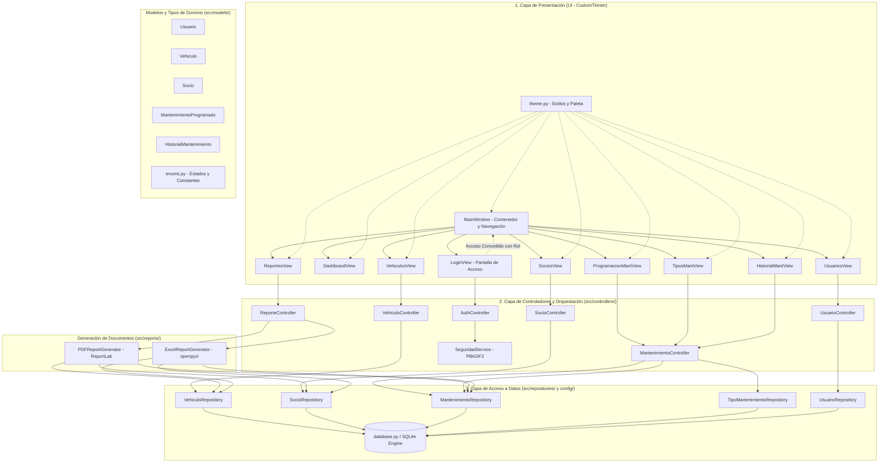
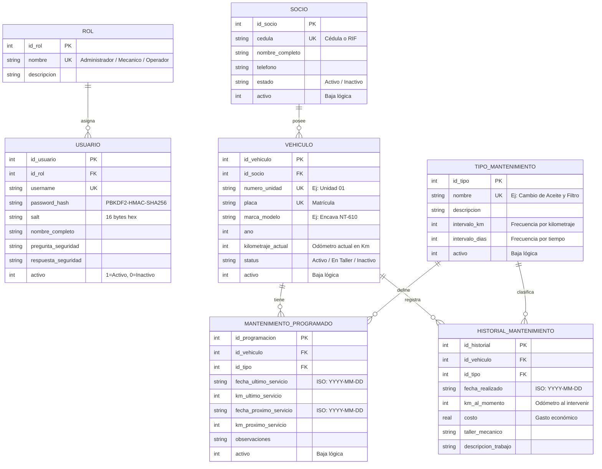

# 🏛️ Arquitectura y Estructura del Sistema

## Sistema de Control de Mantenimiento Preventivo — Brisas del Palmar

---

## 1. Visión General de la Arquitectura

El sistema está diseñado bajo un patrón arquitectónico en **3 Capas Desacopladas (Layered Architecture / MVC adaptado a GUI de escritorio)**, complementado con un módulo de autenticación previa, modelos de dominio compartidos y configuración visual centralizada.


```mermaid
graph TD
    subgraph Presentacion ["1. Capa de Presentación (UI - CustomTkinter)"]
        MW[MainWindow - Contenedor y Navegación]
        V_Log[LoginView - Pantalla de Acceso]
        V_Dash[DashboardView]
        V_Veh[VehiculosView]
        V_Soc[SociosView]
        V_Prog[ProgramacionMantView]
        V_Tip[TiposMantView]
        V_Hist[HistorialMantView]
        V_Rep[ReportesView]
        V_Usr[UsuariosView]
        THEME[theme.py - Estilos y Paleta]
    end

    subgraph Dominio ["Modelos y Tipos de Dominio (src/models/)"]
        M_Usr[Usuario]
        M_Veh[Vehiculo]
        M_Soc[Socio]
        M_Mant[MantenimientoProgramado]
        M_Hist[HistorialMantenimiento]
        ENUMS[enums.py - Estados y Constantes]
    end

    subgraph Controladores ["2. Capa de Controladores y Orquestación (src/controllers/)"]
        C_Auth[AuthController]
        C_Usr[UsuarioController]
        C_Veh[VehiculoController]
        C_Soc[SocioController]
        C_Mant[MantenimientoController]
        C_Rep[ReporteController]
        S_Sec[SeguridadService - PBKDF2]
    end

    subgraph Reportes ["Generación de Documentos (src/reports/)"]
        REP_PDF[PDFReportGenerator - ReportLab]
        REP_XLS[ExcelReportGenerator - openpyxl]
    end

    subgraph Datos ["3. Capa de Acceso a Datos (src/repositories/ y config/)"]
        R_Usr[UsuarioRepository]
        R_Veh[VehiculoRepository]
        R_Soc[SocioRepository]
        R_Tip[TipoMantenimientoRepository]
        R_Mant[MantenimientoRepository]
        DB[(database.py / SQLite Engine)]
    end

    MW --> V_Log
    V_Log --> C_Auth --> S_Sec
    V_Log -.->|Acceso Concedido con Rol| MW
    MW --> V_Dash & V_Veh & V_Soc & V_Prog & V_Tip & V_Hist & V_Rep & V_Usr
    THEME -.-> MW & V_Dash & V_Veh & V_Soc & V_Prog & V_Tip & V_Hist & V_Rep & V_Usr

    V_Veh --> C_Veh --> R_Veh --> DB
    V_Soc --> C_Soc --> R_Soc --> DB
    V_Prog --> C_Mant --> R_Mant --> DB
    V_Tip --> C_Mant --> R_Tip --> DB
    V_Hist --> C_Mant --> R_Mant
    V_Usr --> C_Usr --> R_Usr --> DB
    V_Rep --> C_Rep
    C_Rep --> REP_PDF & REP_XLS
    REP_PDF & REP_XLS --> R_Veh & R_Soc & R_Mant
```

### Principios de Separación

1. **La Interfaz Visual (`src/views/`) NUNCA ejecuta sentencias SQL:** Su única función es renderizar componentes gráficos, capturar eventos de usuario y delegar las operaciones a los *Controllers*.
2. **Los Controladores (`src/controllers/`) orquestan las operaciones y aplican reglas de negocio:** Aquí residen las validaciones de entrada, verificación de unicidad, orquestación transaccional y control de permisos por rol.
3. **Servicio Criptográfico Centralizado (`src/services/seguridad_service.py`):** Encapsula el algoritmo PBKDF2-HMAC-SHA256 con sal aleatoria, normalización de preguntas de seguridad y comparación en tiempo constante.
4. **Los Repositorios (`src/repositories/`) aíslan el motor de datos:** Encapsulan todas las consultas SQL (`SELECT`, `INSERT`, `UPDATE`, `DELETE`) de forma parametrizada contra SQLite.
5. **Configuración y Transaccionalidad (`config/database.py`):** Centraliza la ruta del archivo de base de datos, claves foráneas (`PRAGMA foreign_keys = ON;`), migraciones automáticas y context managers para transacciones atómicas (`get_db_transaction()`).
6. **Modelos de Dominio Compartidos (`src/models/`):** Entidades POO con propiedades de negocio encapsuladas (ej. `usuario.es_admin`, `usuario.puede_modificar_flota()`).

---

## 2. Motor de Base de Datos (SQLite)

### ¿Por qué SQLite y no un servidor de base de datos externo?

- **Cero Configuración:** No requiere instalar ni mantener un servicio o demonio corriendo en segundo plano (evita los fallos clásicos de desconexión `Connection Refused` o error 2003 de MySQL).
- **Portabilidad Absoluta:** Toda la información de la empresa vive en un único archivo físico (`data/mantenimiento.db`). Respaldar el sistema completo se reduce a copiar este archivo.
- **Rendimiento Excepcional en Escritorio:** Al interactuar directamente mediante llamadas a la API de C de SQLite en el sistema de archivos local, se elimina la latencia de protocolos de red TCP/IP.
- **Integridad Referencial Garantizada:** Se activa explícitamente `PRAGMA foreign_keys = ON;` para forzar relaciones estrictas entre socios, vehículos y mantenimientos.

---

## 3. Modelo de Datos Relacional (7 Entidades Normalizadas en 3FN)


```mermaid
erDiagram
    ROL ||--o{ USUARIO : "asigna"
    SOCIO ||--o{ VEHICULO : "posee"
    VEHICULO ||--o{ MANTENIMIENTO_PROGRAMADO : "tiene"
    TIPO_MANTENIMIENTO ||--o{ MANTENIMIENTO_PROGRAMADO : "define"
    VEHICULO ||--o{ HISTORIAL_MANTENIMIENTO : "registra"
    TIPO_MANTENIMIENTO ||--o{ HISTORIAL_MANTENIMIENTO : "clasifica"

    ROL {
        int id_rol PK
        string nombre UK "Administrador / Mecanico / Operador"
        string descripcion
    }

    USUARIO {
        int id_usuario PK
        int id_rol FK
        string username UK
        string password_hash "PBKDF2-HMAC-SHA256"
        string salt "16 bytes hex"
        string nombre_completo
        string pregunta_seguridad
        string respuesta_seguridad
        int activo "1=Activo, 0=Inactivo"
    }

    SOCIO {
        int id_socio PK
        string cedula UK "Cédula o RIF"
        string nombre_completo
        string telefono
        string estado "Activo / Inactivo"
        int activo "Baja lógica"
    }

    VEHICULO {
        int id_vehiculo PK
        int id_socio FK
        string numero_unidad UK "Ej: Unidad 01"
        string placa UK "Matrícula"
        string marca_modelo "Ej: Encava NT-610"
        int ano
        int kilometraje_actual "Odómetro actual en Km"
        string status "Activo / En Taller / Inactivo"
        int activo "Baja lógica"
    }

    TIPO_MANTENIMIENTO {
        int id_tipo PK
        string nombre UK "Ej: Cambio de Aceite y Filtro"
        string descripcion
        int intervalo_km "Frecuencia por kilometraje"
        int intervalo_dias "Frecuencia por tiempo"
        int activo "Baja lógica"
    }

    MANTENIMIENTO_PROGRAMADO {
        int id_programacion PK
        int id_vehiculo FK
        int id_tipo FK
        string fecha_ultimo_servicio "ISO: YYYY-MM-DD"
        int km_ultimo_servicio
        string fecha_proximo_servicio "ISO: YYYY-MM-DD"
        int km_proximo_servicio
        string observaciones
        int activo "Baja lógica"
    }

    HISTORIAL_MANTENIMIENTO {
        int id_historial PK
        int id_vehiculo FK
        int id_tipo FK
        string fecha_realizado "ISO: YYYY-MM-DD"
        int km_al_momento "Odómetro al intervenir"
        real costo "Gasto económico"
        string taller_mecanico
        string descripcion_trabajo
    }
```

### Reglas de Integridad

- **Protección de Socios:** La base de datos y la capa de servicios impiden la eliminación de un socio si tiene vehículos asociados (`ON DELETE RESTRICT`).
- **Eliminación en Cascada de Vehículos:** Al eliminar una unidad, se eliminan sus programaciones activas asociadas (`ON DELETE CASCADE`), pero su bitácora histórica puede mantenerse auditada.
- **Unicidad:** La cédula del socio, la placa del vehículo y el número interno de unidad son claves únicas (`UNIQUE`).

---

## 4. Motor de Mantenimiento Preventivo y Semaforización

El corazón del sistema evalúa simultáneamente dos variables de desgaste:

1. **Desgaste por Uso Físico (Kilómetros recorridos):** $\Delta_{\text{km}} = \text{km\_próximo} - \text{km\_actual}$
2. **Degradación por Tiempo (Días transcurridos):** $\Delta_{\text{días}} = \text{fecha\_próxima} - \text{fecha\_hoy}$

### Matriz de Estados de Alerta

| Estado | Indicador Visual | Condición Matemática | Acción Recomendada |
| :--- | :---: | :--- | :--- |
| **Vencido** | 🔴 Rojo | $\Delta_{\text{km}} \le 0$  ó  $\Delta_{\text{días}} \le 0$ | **Urgente:** La unidad debe ingresar al taller inmediatamente para evitar roturas mecánicas o multas operativas. |
| **Por Vencer** | 🟡 Amarillo | $1 \le \Delta_{\text{km}} \le 500$  ó  $1 \le \Delta_{\text{días}} \le 10$ | **Planificación:** Restan menos de 500 km o 10 días; preparar repuestos y agendar turno en taller. |
| **Al Día** | 🟢 Verde | $\Delta_{\text{km}} > 500$  y  $\Delta_{\text{días}} > 10$ | **Óptimo:** Unidad apta para operar en ruta regular. |

### Ciclo de Ejecución de Mantenimiento

Cuando el usuario registra un mantenimiento ejecutado en [`ProgramacionMantView`](file:///home/yheremyt/PROYECTO-MANTENIMIENTO/src/views/programacion_mant_view.py):

1. Se crea un registro inmutable en `historial_mantenimiento` con fecha, taller, costo y detalles.
2. Si el odómetro ingresado es superior al odómetro registrado del vehículo, `vehiculo.kilometraje_actual` se actualiza automáticamente.
3. Se recalcula el próximo vencimiento:
   $$\text{km\_próximo} = \text{km\_servicio} + \text{intervalo\_km}$$
   $$\text{fecha\_próxima} = \text{fecha\_servicio} + \text{intervalo\_días}$$
4. El semáforo vuelve automáticamente a 🟢 **Al Día**.

---

## 5. Estructura de Directorios del Código

```text
PROYECTO-MANTENIMIENTO/
├── config/
│   ├── __init__.py
│   └── database.py                 # Conexión SQLite, función init_db() y gestor de contexto
├── database/
│   ├── schema.sql                  # Definición DDL de tablas e índices
│   └── seeds.sql                   # Catálogo inicial de 10 mantenimientos preventivos estándar
├── docs/                           # Documentación técnica y manuales de usuario
│   ├── ARQUITECTURA.md             # Este documento
│   ├── GUIA_INSTALACION_Y_USO.md   # Guía paso a paso de despliegue y manual de usuario
│   ├── LOGIN.md                    # Credenciales y alcance del módulo de autenticación
│   └── README.md                   # Índice general de documentación
├── src/
│   ├── __init__.py
│   ├── models/                     # Modelos y enumeraciones de dominio compartidas
│   │   ├── __init__.py
│   │   └── enums.py                # Enums tipados (EstadoVehiculo, EstadoSocio, EstadoMantenimiento)
│   ├── repositories/               # Capa de Acceso a Datos
│   │   ├── __init__.py
│   │   ├── socio_repository.py
│   │   ├── vehiculo_repository.py
│   │   ├── tipo_mantenimiento_repository.py
│   │   └── mantenimiento_repository.py
│   ├── services/                   # Capa de Lógica de Negocio y Reglas
│   │   ├── __init__.py
│   │   ├── autenticacion_service.py # Validación de credenciales de acceso
│   │   ├── socio_service.py
│   │   ├── vehiculo_service.py
│   │   ├── tipo_mantenimiento_service.py
│   │   └── mantenimiento_service.py
│   └── views/                      # Capa de Presentación (CustomTkinter)
│       ├── __init__.py
│       ├── theme.py                # Paleta corporativa, tipografía estándar y estilos Treeview
│       ├── login_view.py           # Pantalla modal de inicio de sesión
│       ├── main_window.py          # Ventana principal con barra lateral de navegación
│       ├── dashboard_view.py       # KPIs y panel de alertas críticas
│       ├── vehiculos_view.py       # Gestión de flota con número de unidad y odómetro
│       ├── socios_view.py          # Gestión de socios y propietarios
│       ├── programacion_mant_view.py # Tablero de semáforos preventivos y registro de servicios
│       ├── tipos_mant_view.py      # CRUD de rutinas de mantenimiento preventivo
│       └── historial_mant_view.py  # Bitácora histórica y auditoría de costos
├── tests/
│   └── test_services.py            # Suite de pruebas unitarias automáticas (3 pruebas)
├── data/
│   ├── mantenimiento.db            # Base de datos SQLite (se auto-genera en la 1ra ejecución)
│   └── test_mantenimiento.db       # Base de datos aislada para testing (auto-generada)
├── CHANGELOG.md                    # Bitácora de cambios y versiones del proyecto
├── main.py                         # Punto de entrada de la aplicación
├── requirements.txt                # Lista de librerías requeridas (customtkinter)
├── .gitignore                      # Exclusión de entornos virtuales, bases de datos y cachés
└── README.md                       # Resumen rápido del repositorio
```
